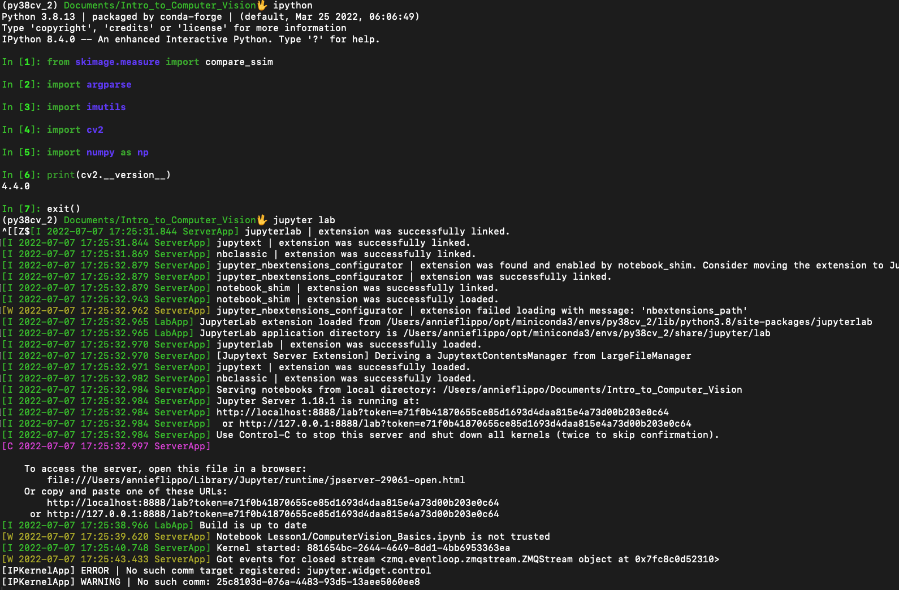
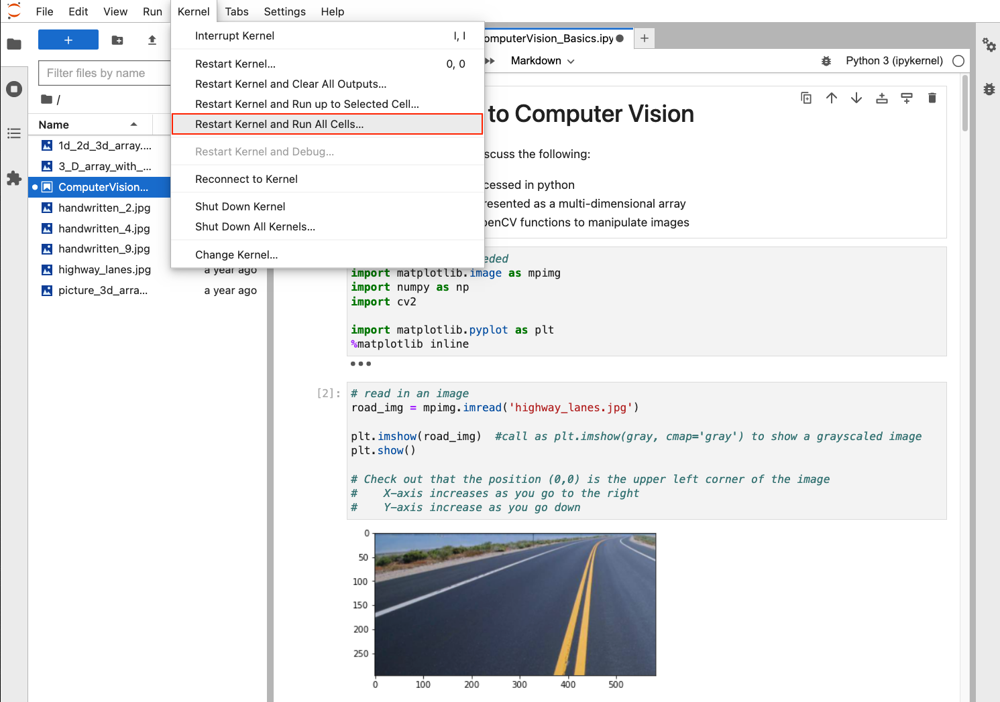

# Introduction to Computer Vision

This is an introduction to Computer Vision using Python.
Online resources and examples are used whenever it is available.
Inline reference to the source code are provided for discussions
and inspiration.

This is an introductory class to computer vision using Python.  Some basic knowledge in Python programming is preferred but not required.  If you want to get a head start, learning the foundation of Python will help.  Check out free resources here: https://www.freecodecamp.org/news/learn-python-free-python-courses-for-beginners/, especially Python Basics with Sam (YouTube) - from freeCodeCamp.  It's only a 4.5 hour video (think of it as 2 Marvel movies) ... totally doable. 😂 😂 😂

## Topics

__Lesson 1: Computer Vision Basics__
* 1D, 2D and 3D arrays
* Read in a picture
* Grayscale a picture
* Subset an array and picture

__Lesson 2: Blurring__
* Primary Colors in computer vision is Red, Green and Blue
* Subtractive versus Additive color processes
* Why blur a picture

__Lesson 3: Edge Detection__
* How to write a function in Python
* What is a gradient (in the x-direction)
* Write your own gradient function (for the y-direction) for a grayscale picture

__Lesson 4: Color Detection__
* Bitwise operations
* Error Handling in Python
* Another color coding system (HSV = Hue, Saturation and Value)
* Finding contours

__Lesson 5: Shape Detection__
* Shapes
* SMore on contours
* SCentroid and Area from Contours
* Occulsion

__Lesson 6: Shape Detection__
* Angles
* Distance
* Distortions

## Environment
The instructions below have been tested on Python 3.8.
I mainly use Anaconda https://www.anaconda.com/products/individual > Products > Individual Edition
as my virtual environment and install the necessary packages.

Here are the steps in creating your environment:

1. Install Anaconda according to the instructions for your operating system.

2. Create a python 3.8 with the basic packages as follows in your terminal via command line for Mac OS.
For Windows, you will need to use the __"Anaconda Prompt"__ and not the generic Window's Prompt.

<pre><code>
   prompt> conda env create -f py38cv.yml
</code></pre>

It will automatically start collecting package information and install all the required python packages.

3. Activate your environment

<pre><code>
   prompt> conda activate py38cv
</code></pre>

4. To verify your environment, invoke the ipython interactive command prompt by executing "ipython" in your terminal.

<pre><code>
   prompt> ipython
</code></pre>

Note: if you type "python", it might return an error and this is normal.  Don't worry about this.

5. Test you can import the following packages at ipython's command prompt

<pre><code>
   In [1]: from skimage.measure import compare_ssim

   In [2]: import argparse

   In [3]: import imutils

   In [4]: import cv2

   In [5]: import numpy as np

   In [6] print(cv2.__version__)
   4.4.0

   in [7]: exit()
</code></pre>

 

 

6. To launch the browser IDE (integrated development tool), run:

<pre><code>
   py38cv> jupyter lab
</code></pre>

Open up a Jupyter notebook by clicking on Lesson1> ComputerVision_Basics.ipynb
and run "Restart Kernel and Run All Cells...".

 

 

You should encounter no errors.  Now your environment is ready to go.

 

### <b>OpenCV Troubleshooting</b>
The yml file has opencv package dependencies but if you get an error when "import cv2" try to install OpenCV manually again.

<pre><code>
   py38cv> conda install -c conda-forge opencv
</code></pre>

 

### <b>Windows Environment Troubleshooting</b>

If you have issues importing imutils, try the following to install imutils.

<pre><code>
   py38cv> conda install pip
   py38cv> pip install imutils
</code></pre>

Or, for Windows 10 64-bit, try:
<pre><code>
   py38cv> conda install -c pjamesjoyce imutils
</code></pre>

 

## <b>Jupyter Notebook IDE</b>

To launch the browser IDE (integrated development tool), run:

<pre><code>
   py38cv> jupyter lab
</code></pre>

This will start the Notebook IDE in your preferred browser as http://localhost:8888/?token=xxxx .
You can always grab the link and paste it in your browser if needed.

Open up a Jupyter notebook by clicking on Lesson1> ComputerVision_Basics.ipynb
and run "Restart Kernel and Run All Cells...".

 

 

You should encounter no errors.  Now your environment is ready to go.

To exit your Notebook environment, just save your notebook and close all Jupyter notebook tabs in your browser.   On the command prompt from where your notebook was launched, type Ctrl-C to stop the IDE and type "y" <hit return> to confirm.

To deactivate your python environment run "conda deactivate" at the command prompt.

<pre><code>
   py38cv> Ctrl-C [enter]
   py38cy> y [enter]
   py38cv> conda deactivate
</code></pre>

Note: __DO NOT USE the Anaconda Navigator__ (the GUI) to launch your Juypter notebook as it will not  initiate your py38cv environment as required for these lessons.

 

### <b>Troubleshooting Jupyter Lab</b>

If you have issues launching "juypter lab", re-install on command prompt.

<pre><code>
   py38cv> conda install -c conda-forge jupyterlab
</code></pre>
